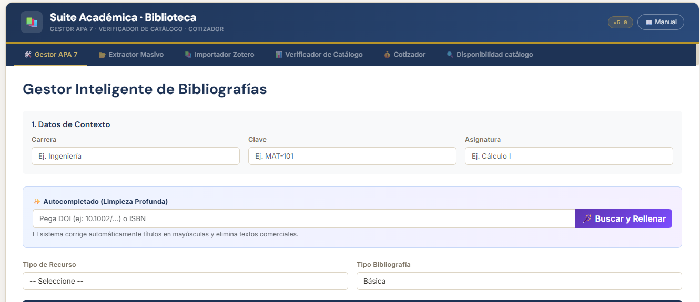
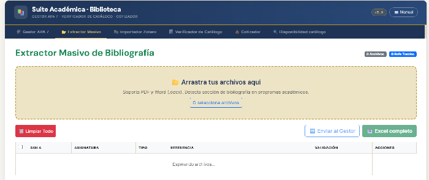

# 📚 biblio-verifica

> Herramienta standalone para verificación de referencias bibliográficas y cotización de adquisiciones — sin instalación, sin servidor, sin dependencias externas.

---

## ¿Qué problema resuelve?

En las bibliotecas universitarias, la revisión de bibliografías es un cuello de botella recurrente: las listas de referencias llegan en formatos inconsistentes, verificar manualmente cada título contra el catálogo consume horas, y coordinar cotizaciones de adquisición es un proceso disperso.

Esta herramienta digitaliza ese flujo completo en una sola página web que corre directamente en el navegador.

---

## ¿Qué hace?

### Pestaña 1 — Verificador de catálogo

Permite importar una lista de referencias bibliográficas en formato Excel y compararlas automáticamente contra el catálogo físico de la biblioteca mediante un **algoritmo de coincidencia aproximada (fuzzy matching)**, que:

- Normaliza tildes, puntuación y variaciones tipográficas
- Detecta coincidencias parciales por título, autor y año
- Clasifica cada referencia como **encontrada**, **posible coincidencia** o **no encontrada**
- Exporta los resultados en Excel con el estado de cada ítem

### Pestaña 2 — Cotizador de adquisiciones

Las referencias marcadas como "no encontradas" se envían automáticamente al cotizador, donde:

- Se pueden buscar en **BookFinder**, **BuscaLibre Chile**, **Amazon** y **MercadoLibre** con un solo clic por título
- Se puede registrar precio, proveedor y notas por ítem
- Se exporta el listado de cotización en Excel para gestión de compras

---

## Demostración

### Extarctor masivo

---

## Cómo usar

No requiere instalación. No requiere conexión a internet (excepto para las búsquedas en tiendas).

1. Descarga el archivo `index.html` desde este repositorio
2. Ábrelo en cualquier navegador moderno (Chrome, Firefox, Edge)
3. Importa tu archivo Excel con las referencias y el catálogo
4. Ejecuta la verificación y exporta los resultados

Eso es todo.

---

## Formato del archivo de entrada

El archivo Excel de referencias debe tener al menos estas columnas:

| Columna       | Descripción                        |
|---------------|------------------------------------|
| `titulo`      | Título del libro o recurso         |
| `autor`       | Autor(es) en formato texto libre   |
| `año`         | Año de publicación                 |
| `isbn`        | Opcional, mejora la precisión      |

El catálogo de la biblioteca se carga en un segundo archivo con la misma estructura mínima.

---

## Tecnologías utilizadas

- HTML5 + CSS3 + JavaScript vanilla (sin frameworks)
- [SheetJS](https://sheetjs.com/) para importación/exportación Excel
- Algoritmo propio de coincidencia aproximada (v4.1)
- Tipografía: Inter · DM Sans · DM Mono

Todo el procesamiento ocurre en el navegador del usuario. **Ningún dato sale del equipo.**

---

## Adaptar para otra institución

Esta herramienta fue desarrollada en una biblioteca universitaria chilena, pero está diseñada para ser reutilizable.

Para adaptar a tu institución necesitas:

1. Cambiar el logo y nombre institucional en el encabezado (líneas 12–18 del HTML)
2. Ajustar las columnas del Excel de catálogo según el formato de tu sistema (función `mapColumns` en el JS)
3. Opcionalmente, agregar o quitar proveedores de búsqueda en la pestaña Cotizador

Si necesitas ayuda con la adaptación, puedes abrir un [Issue](../../issues) o escribir directamente.

---

## Roadmap

- [ ] Búsqueda directa por ISBN a través de Open Library API
- [ ] Soporte para catálogos exportados desde Koha y otros ILS
- [ ] Modo multi-biblioteca (comparar contra catálogos de varias sedes)
- [ ] Historial de cotizaciones persistente (opcional)

---

## Autor

**Pablo [Coronel]**
Profesional de biblioteca 
[LinkedIn](#) · [Correo](#)

---

## Licencia

MIT — puedes usar, modificar y distribuir libremente con atribución.

